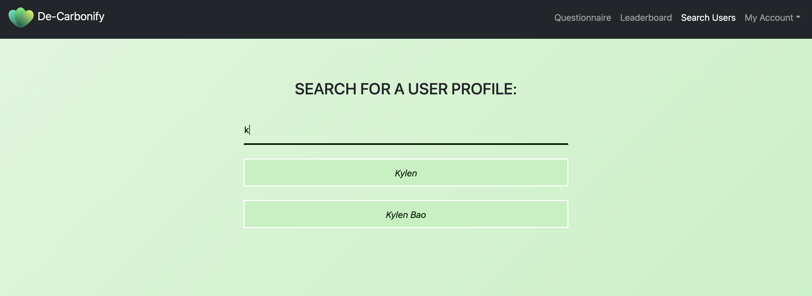
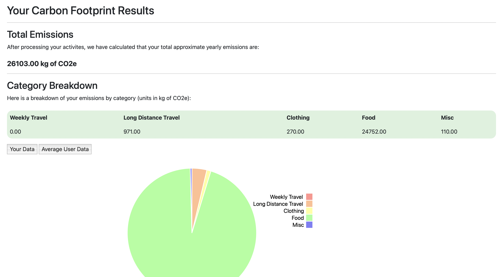
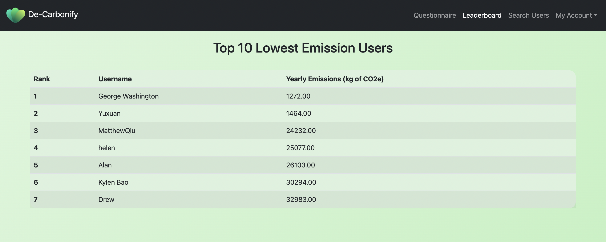
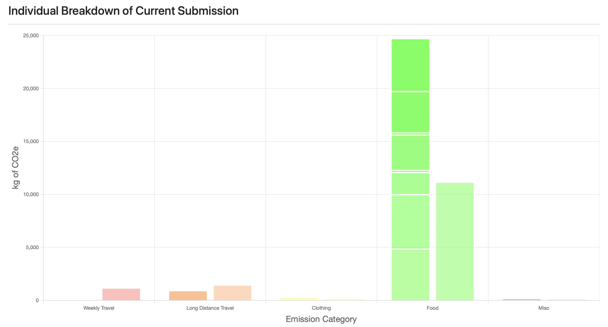
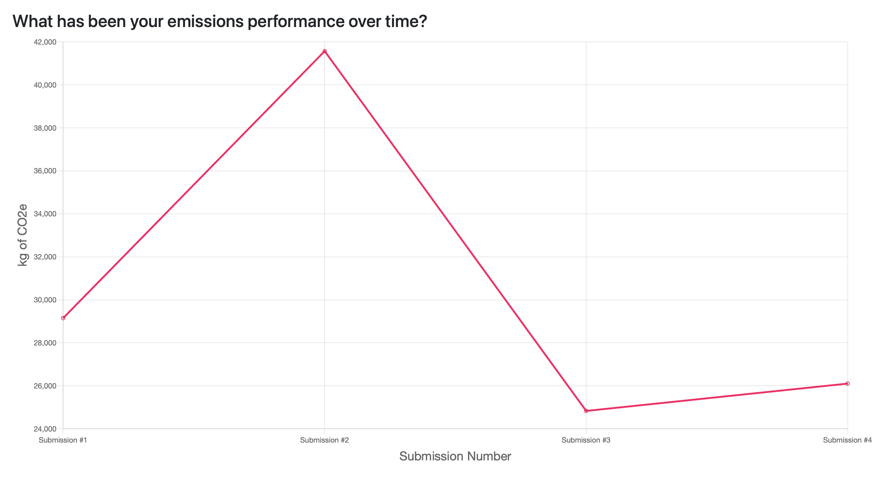
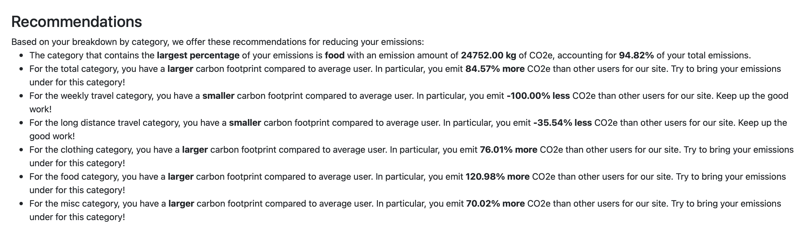
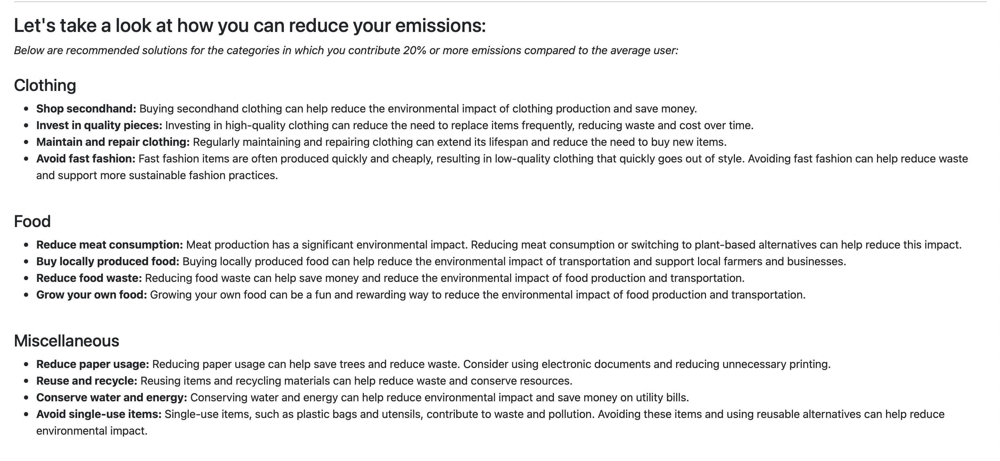

# De-Carbonify

<p align="center">
    <br>
</p>

## Description

De-Carbonify is a carbon footprint calculator app that empowers users to reduce their carbon footprint through data-driven recommendations and interactive visualizations. By inputting information on their transportation, clothing, goods purchases, and food consumption habits, users can receive a personalized breakdown of their carbon emissions. Our algorithm then provides tailored recommendations for reducing emissions based on the user's unique profile and how their emissions compare to the average user.

Our app aims to raise awareness about the environmental impact of individual actions and provide users with actionable steps to reduce their carbon footprint. The interactive data visualizations we provide help users better understand their carbon emissions data and make informed decisions about their lifestyle. Our ultimate goal is to promote a more sustainable and environmentally conscious way of living for all.

## Key Features

| Features | Data Visualizations |
| --- | --- |
|  |  |
|  |  |
|  |  |

* **User Lookup**
  * Allow users to search for other users by name
  * Display carbon emissions information about the searched user
* **Leaderboard**
  * Display the top carbon footprint reductions achieved by individual users or teams of users
  * Update the leaderboard in real-time as new data becomes available, such as when users log new carbon-reducing actions
* **Chart.js and D3.js Data Visualizations**
  * Create graphics to display user's carbon footprint with:
      * Individual category breakdown
      * Comparison to the average user
      * Progression over multiple entries / time
  * Use Chart.js or D3 libraries to customize the appearance and behavior of the visualizations (hovering to change colors, labels) 
* **Form Input and Validation**
  * Create forms for users to input data about their daily travel and consumption activities
  * Prevent form submission if data is missing or invalid
* **Login and Authentication**
    * Enables secure user login using a single set of credentials and hashed passwords
    * Secure, encrypted HTTPS connection


| Summary | Recommendations |
| --- | --- |
|  |  |


## Team Members

* Helen Zhou
* Kylen Wei Bao
* Matthew Qiu
* Neil Shah


## Getting Started
Change to the ```app``` directory 

```python3 run.py```

## Technology Stack

**Front-End:**
HTML, CSS, Javascript (JQuery), Bootstrap

**Back-End:**
Python, Flask, SQLite

**Libraries:**
Flask-SQLAlchemy, Flask-Login, D3.js, Chart.js
